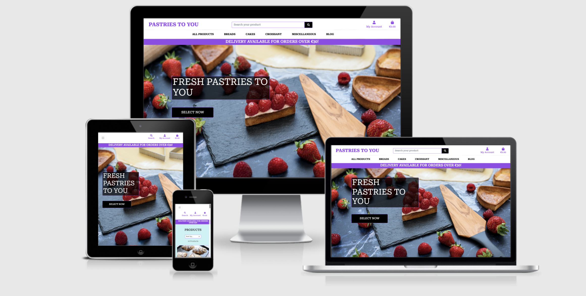
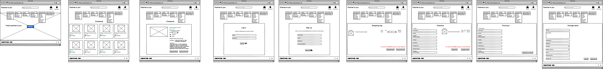
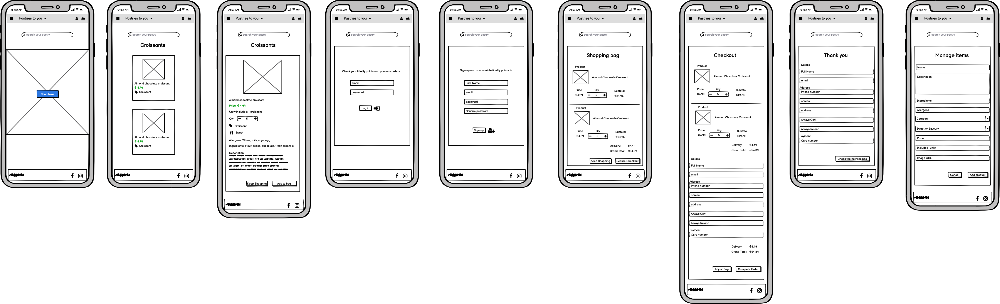
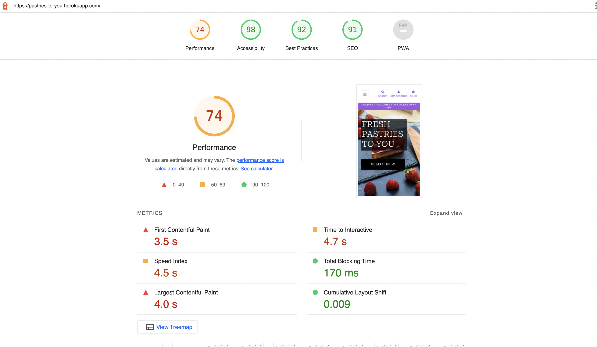
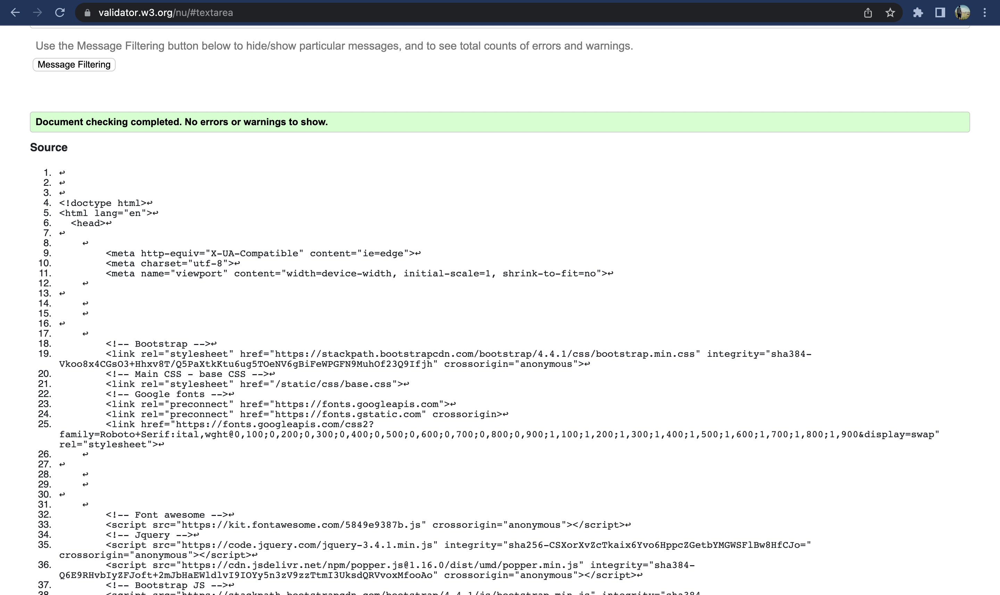
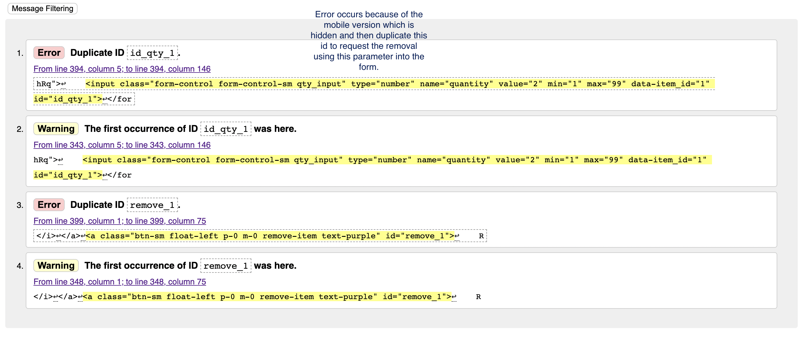
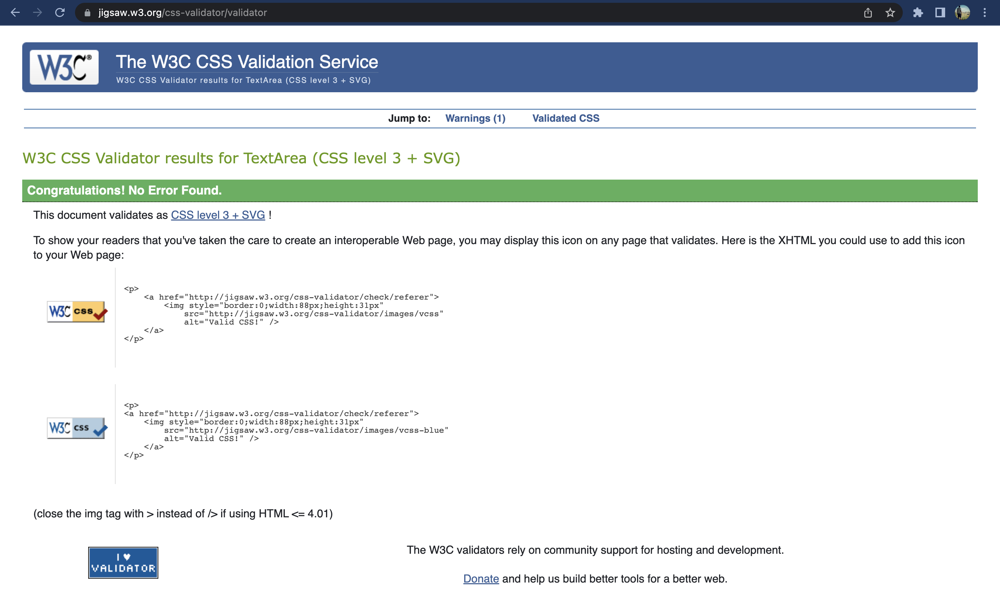
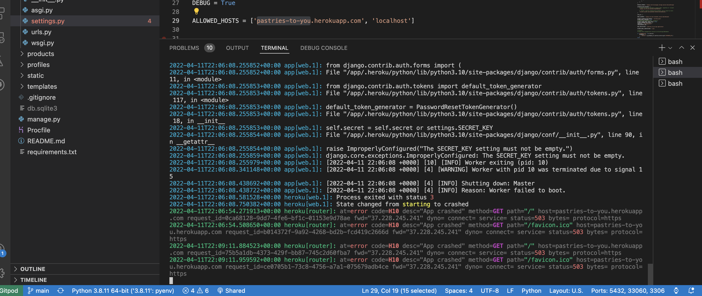

# Pastries to you - Pastry E-commerce


[Live project link](https://pastries-to-you.herokuapp.com/)

## **Project Introduction**

The scope of this project consists in practicing the knowledge learned up to this point with the [Code Institute](https://codeinstitute.net/all-access-coding-challenge/?utm_term=code%20institute&utm_campaign=a%26c_SEA_IRL_BR_Brand_Code_Institute&utm_source=adwords&utm_medium=ppc&hsa_acc=8983321581&hsa_cam=14304747355&hsa_grp=128775288209&hsa_ad=539453915484&hsa_src=g&hsa_tgt=kwd-319867646331&hsa_kw=code%20institute&hsa_mt=e&hsa_net=adwords&hsa_ver=3&gclid=CjwKCAiAvriMBhAuEiwA8Cs5lb4K7BEL5Kg1c8ZXfzdHRSPwEYkb_aMKSzaeFovYBDDbML-RP8UVoBoCyp4QAvD_BwE) -  software development course - and make a project based on the last section of the course dedicated to use of Django in conjunction with the frontend and Backend and also a database. This project is the final outcome from the whole Knowledge accrued during the course.

The project idea came from a course suggestion but also a personal wish to learn how to build a functional e-commerce that could be the base for a future adventure to undertake a business with my wife. The project scope allows the user to store her recipes in an organized, safe and accessible way from everywhere.

This project provided to me some new interesting outcomes in my journey to become a better developer. In this project was possible to practice more of of [Python](https://www.python.org/), HTML, CSS, but mostly with [Django](https://www.djangoproject.com/) and some of the immense possibilities this framework offers. Another important aspect was to integrate a simple version of [Stripe payments](https://stripe.com/ie?utm_campaign=paid_brand-IE_en_Search_Brand_Stripe-1615558792&utm_medium=cpc&utm_source=google&ad_content=307359047676&utm_term=kwd-295607662702&utm_matchtype=e&utm_adposition=&utm_device=c&gclid=CjwKCAjw6dmSBhBkEiwA_W-EoAMF3BDf4uNrMboFU7yCyWHTi7ndFuxxH7xc-y-oj6llv6nJ6SJaHBoCHisQAvD_BwE) in the website utilizing webhooks as well.

**Stripe test card for the checkout is:**
| KEY            | VALUE         |
|----------------|---------------|
| Card number: | 4242 4242 4242 4242 |
| Expire date: | 04 / 24 or any other  |
| CVC: | any three digits number or 242  |
| Zip: | 42424 or any other |


## **Table of Contents**
1. [UX and General Design](#ux-and-general-design)
    1. [User Stories](#user-stories)
    1. [Wireframe](#wireframe)
    1. [Database](#database)
1. [Features](#features)
    1. [Existing Features](#existing-features)
    1. [Features Left To Implement](#features-left-to-implement)
1. [Technologies Used](#technologies-used)
1. [Testing](#testing)
    1. [Mannual Tests and Notable Bugs](#mannual-tests-and-notable-bugs)
        - [Empty URL's Picture input form](#empty-url's-picture-input-form)
        - [Defensive Programming](#defensive-programming)
    1. [Responsiveness](#responsiveness)
1. [Deployment](#deployment)
    1. [Deployment to Amazon S3 IAM](#amazon-webservice-s3-and-iam)
    1. [Deploying to Heroku](#deploying-to-heroku)
1. [Credits](#credits)
    1. [Media](#media)
    1. [Acknowledgements](#acknowledgements)

## **UX and General Design**

The concept of this project borned from the idea to accomplish the client, shop user and owner. The scope was thought to be functional implementing all the basic core functionalities of an e-commerce. This design from this project combines the Boutique Ado, a project from code institute, keeping the main sctruture but implementing some visual and functional aspects to match with the store idea.

Embeded with those ideas and the user stories from below was possible to formulate the framework.

### **User Stories**

#### **Client goals**

- As a client, I want to be able to view a list of products, so that I can select some of them to purchase.

- As a client, I want to be able to view each product's details, so that I can check the price, description, ingredients, image, how much unity is included, category, allergens and if it is sweet or savory.

- As a client, I want to view the grand total of my purchases at any time so that I can check how much I am spending.

- As a client, I want to be able to sort through the list of products, so that I can identify the best different categories, priced or by sweet or savory.

- As a client, I want to be able to sort a specific product category, so that I can find the best price in each specific category and/or sort the category by name.

- As a client, I want to be able to search for a product by name and/or description, so that I can find a specific product I want to purchase.

- As a client, I want to be able to select the amount of the product I am buying.

- As a client, I want to be able to easily select the quantity of a product when purchasing it.

- As a client, I want to be able to view items in my basket to be purchased, so that I can check the total cost of my items and make sure which Items I will receive or collect.

- As a client, I want to be able to adjust the amount of individual items in my basket, so that I can easily make changes before the checkout.

- As a client, I want to be able to easily enter my payment information, so that I can check out without any problems.

- As a client, I want to be able to make sure my private payment information is safe and secure, so that I can confidently provide the needed information.

- As a client, I want to be able to view an order confirmation after the checkout, so that I can verify I haven't made any mistakes.

- As a client, I want to be able to receive a confirmation by e-mail after the checkout, so that I can keep registered the order Information for any eventuality.


#### **Shop user goal**
- As a shop user, I want to be able to easily register my account so that I can have a personal account and be able to check my profile.

- As a shop user, I want to be able to easily log in and out, so that I can access my personal information.

- As a shop user, I want to be able to reset my password, so that I can recover access to my account.

- As a shop user, I want to be able to have a personalized user profile, so that I can check my personal order history and the number of fidelity points accrued at the moment.

#### **Site owner's goal**
- As a shop owner, I want to be able to add a product, so that I can add new items to my shop.

- As a shop owner, I want to be able to edit and update the product, so that I can change product prices, amounts, images and more.

- As a shop owner, I want to be able to delete a product, so that I can remove items that are no longer for sale.

- As a shop owner, I want to be able to make sure that only I can add/edit/delete items from my shop. I want to make sure that anyone else can make changes to my products.

- As a shop owner, I want to have the possibility to communicate with my customers through a blog where I will be able to see customer’s commentaries creating a small community.


### **Wireframe**

As a result of the above the wireframe was design to deliver all the functions needed such as search for the ideal product, have details of each of those products, the possibility to select that item and quantity, a bag to temporary storage those items, a checkout process and a confirmation for each order as a form to have a history.

With that in mind the initial wireframe was designed to accomplish all the core necessities: 

See in details clicking on this [Desktop Version](media/Desktop.png)
<p align="center">

</p>

See in details clicking on this [Mobile Version](media/Mobile.png)
<p align="center">

</p>

## Database

The database in this project was integrated following the Django solution, consisting of configuring the called models in order to create the tables with SQLite. The main goal in this project was to understand the potential of this built in solution. This format accelerates the development process minimizing the necessities to deal some time with more complex queries to proceed with CRUD operations.

The desing or Schema was defined as bellow:

**Category and Product Models**

Category:
```
name = models.CharField
friendly_name = models.CharField
```

Product:
```
category = models.ForeignKey('Category',
sku = models.CharField
name = models.CharField
description = models.TextField
price = models.DecimalField
sweet_sauvory = models.CharField
included_unity = models.CharField
allergens = models.CharField
image_url = models.URLField
image = models.ImageField
```

The connection between those models are set for the **ForeignKey Category** into products model.

**Order and Orderline Models**

Order:
```
order_number = models.CharField
user_profile = models.ForeignKey(UserProfile,
full_name = models.CharField
email = models.EmailField
phone_number = models.CharField
country = CountryField
postcode = models.CharField
town_or_city = models.CharField
street_address1 = models.CharField
street_address2 = models.CharField
county = models.CharField
date = models.DateTimeField
delivery_cost = models.DecimalField
order_total = models.DecimalField
grand_total = models.DecimalField
original_bag = models.TextField
stripe_pid = models.CharField
```

In the order there is a connection between this and the **UserProfile** models set by **ForeignKey user_profile**.

Ordeline:
```
order = models.ForeignKey(Order,
product = models.ForeignKey(Product,
quantity = models.IntegerField
lineitem_total = models.DecimalField
```

The connection between the **Order** models and the **Orderline** was established by the **ForeignKey Order** into Ordeline model.

**UserProfile Model**

UserProfile:
```
user = models.OneToOneField(User, on_delete=models.CASCADE)
default_phone_number = models.CharField
default_street_address1 = models.CharField
default_street_address2 = models.CharField
default_town_or_city = models.CharField
default_county = models.CharField
default_postcode = models.CharField
default_country = CountryField
```

This models was used connected in different model as **ForeignKey** for its capacity to bind user information to other models creating an important data association.

**Post and Comments Model**

Post:
```
title = models.CharField
slug = models.SlugField
intro = models.TextField
post_article = models.TextField
post_date_stamp = models.DateTimeField
post_user = models.ForeignKey(UserProfile,
```
In the Post model there is a connection between this and the **UserProfile** models set by **ForeignKey UserProfile** to register each new post with the author.

Comments:
```
post = models.ForeignKey(Post,
comments_user = models.ForeignKey(UserProfile,
comments_article = models.TextField
comments_date_stamp = models.DateTimeField
```

In the Comments model there is a connection between this and the **UserProfile** models set by **ForeignKey UserProfile** but also the Post model through **ForeingKey Post** to have the possibility to attach each comments to the respective Post blog.


## **Features**

As expected the initial design suffered some changes to accommodate better all the functions and user experience. Below there are all the major functionalities that were possible to implement and those which were not possible to do it.

### **Existing Features**
Below will be possible to take a look at some of the important features of this project.
 
1. Navbar & Sidebar for general navigation with all the major categories and filters;

2. A search bar to query the products or description in the database and return the value expected.

3. Home invites the user to search, know the products by the category, price, taste and more.

4. All products where possible to select a more detailed view clicking in it card or use a filter to a more precise search experience.

5. Individual product page - full visualization of the product details and possibility to add in the shop card. For super users logged in the possibility to delete and update the product.

6. Bag page - after select some product and clicking on the bag or the notification system the page exhibited will show up a summary of the items selected, price, quantity, delivery cost or if it is an available options, two buttons one to return and other to proceed to Stripe checkout but also an option to adjust the quantity or even remove for complete the item from bag.
    
7. Checkout - this page will exhibit and form to complete with personal detail and Stripe elements to complete the order. Once more in this process the user will be notified about the availability or not from the delivery option. 

8. Checkout success - After completing an order the user will be presented with a checkout confirmation and a notification that an email will be sent to summarize the actual order.

9. Login system - Django provides a secure login system that was implemented in this app allowing users to create a new user, receive an email for confirmation, recover forgotten passwords and all in mannerly safety form.

10. My Profile - user will have saved their personal details for future orders in order to make it simpler the next time. Also, the user will have a history of all the orders effectuated in this page with the possibility to access the complete info as register.

11. Blog and comments - in the almost separate section the idea is to create a communication channel between the site owner or chef and their customer providing Knowledge blog posts and receiving comments but this latter option only available for logged users. 

12. Blog Management - The site owner also accumulates another function to include new posts, edit or even delete them all together.

13. Product Management - The site owner also accumulates another function to include new products, edit or even delete them.
    
### **Features Left To Implement**
For the lack of time it was not possible to implement a function to count the number of orders and after completing 10 the next order would give some percentage of discount as a simple form to create a sense of fidelity with the customer.

Another feature that was not implemented was the function for the store owner to have the possibility to delete comments from users in case of need using the frontend in the same manner it is possible to do with posts.


## **Technologies Used**

All the Technologies utilised to built this web app can be found bellow with the respective links.

### **Languages**
- [HTML](https://en.wikipedia.org/wiki/HTML) to build the whole structure of the landing page.
- [CSS](https://en.wikipedia.org/wiki/CSS) to style the webiste.
- [JavaScript](https://en.wikipedia.org/wiki/JavaScript), more specifically [Jquery](https://jquery.com/) was use it to personalize some bootstrap components.
- [Python](https://www.python.org/) to build majority of the backend instructions on app.py file.

### **Frameworks and others**

- [Gitpod](https://www.gitpod.io/) as the code editor.
- [Bootstrap](https://getbootstrap.com/) was utilized in this project as the base for styling the webpage as some components which produce the final form of this project.
- [Django](https://www.djangoproject.com/) was used in conjunction with Python to build the functional banckend logic of the web app and also allow the use of built in components which accelerates the development process.
- [Stripe](https://stripe.com/) responsabile to offer an payment processor solution that was integrated within this project.
- [SQLite](https://sqlite.org/index.html) was used in the development process as builtin django solution.
- [Heroku Postgres](https://www.heroku.com/postgres) was after deployment to Heroku migrating from SQLite.
- [Git](https://git-scm.com/) was used as tool to control the version of the project.
- [Git Hub](https://github.com/) to store the project with versionament control
- [Heroku](https://pages.github.com/) to deploy the live project.
- [AmazonAWS - S3](https://aws.amazon.com/) to deploy all static files and media files.
- [Balsamiq](https://balsamiq.com/) to wireframe the ideia of the website.
- [Am I responsive](http://ami.responsivedesign.is/#) to help visualize the webiste in different screens sizes and get a print of it.


## **Testing**

The automated test utilised were [Google Lighthouse](https://developers.google.com/web/tools/lighthouse) to test general performance, [W3C Markup](https://validator.w3.org/nu/) validation service for the find any inconsistency in the HTML and  [W3C Jigsaw CSS](https://jigsaw.w3.org/css-validator/#validate_by_input) validation service for CSS.

All the possible erros founded by W3C validators were corrected less those ones being part of bootstrap Frameworks or Django.

All the results can be seeing below.

Google Lighthouse results:
<p align="center">

</p>

W3C Markup almost all html templates got this result. They were tested with an manual inpunt in the toll using the source code after ther render on the browser to avoid erros from django templates:
<p align="center">

</p>

An error example is this one that was not possible to correct because of the form the checkout was implemented hidden the mobile visualiztion but still being presented on the html sctrucute:
<p align="center">

</p>

W3C Jigsaw CSS for style.css results:
<p align="center">

</p>

**Python corrections**
For correct PEP8 it was used the command:"python3 -m flake8" and then correcting line by line in order to eliminate them from the list. The majority of errors were related to indentiont with line too large or even lack of space or too much space.All possible to correct were done but without incurring in the risk to change the functionality of the code or then in cases that were related to automatic files created for Django.

### **Manual Tests and Notable Bugs**
The website was manually tested to check if it was working properly in all functionalities. Many attempts to run the app were executed, making orders, adding and removing from the bag, editing products, delete products, adding products with url pictures or jpeg images. Also, the same was done regarding the blog section with edit, add and delete for post and the possibility to add posts. 

Tests using login using Django allauth were done to understand if they were all functional, registering, loggin, resetting passwords and receiving email to confirm those possibilities. 

Thests with the sending of email confirming the order for both cases when the Delivery option was associated or not and in both cases the user was receiving the correct message.

Following that I can confirm that in all my best capabilities the app is working as initially intended.

#### **Deployment to Heroku Error**
After the deployment the process and with the build already completed and the message of success my app was not opening. Then to further investigate I used to command ```heroku logs --tail``` and the I could seen the error message below:

<p align="center">

</p>

After investigating in the CI Slack channel and also in the Heroku documentation I found a solution through two steps.

First it was necessary to restart the Heroku Dynos following this [documentation](https://devcenter.heroku.com/articles/heroku-cli-commands#heroku-dyno-restart-dyno) through the command ```heroku dyno:restart```. This eliminated half the errors displayed.

Then the second step was to implement all the config variables in Heroku, for example the Stripe ones, and then restart Gitpod and finally the error was gone and the project starts to run on Heroku servers.

#### **Defensive Programming**

The implementation of the security in this project was a bit different taking in consideration the previous one. Django has some built-in solutions as the use of decorators in conjunction with django templates logic using if statments  and session.user to avoid that untentionally path can be reach. 

Below is possible to visualise one example the logic created to implement this:
```

    
        <a href="" class="dropdown-item text-purple">Product Management</a>
        <a href="" class="dropdown-item text-purple">Blog Management</a>
    
```

In cases manually this path is tried the user will get redirected to the login page.

### **Responsiveness**

This project was developed to work in a diverse range of screens. All the components from Bootstrap and it’s Grid system are responsive and were added to them with personalized CSS to improve their capabilities in delivering a better UX and achieve satisfactory usage. With big screens more information will be shown in more comfortable form by the website having enough responsiveness to scale in small screens.

As explained this project will work fine in at least 3 different sizes Desktop,Tablet and mobile. To achieve this the website has been tested on several possible devices, from 11 "or 13" inch Macs, Google Chrome developer tools, variable Android phones of friends and relatives.

## **Deployment**

To deploy this project it was utilized by Heroko with static collect disabled and Amazon Web service S3 for the static files and IAM and all media files were stored with Amazon as well.

The process of deploying involves creating an Heroku app setting to not collect static and then implementing the setting with Amazon web service, configure all variables in heroku and after all push everything to it.

### **Amazon webservice S3 and IAM**
1. First it is needed to create an account at aws.amazon.com
2. After complete this process open search for the S3 application and then create S3 bucket named - it is recommended to use the same name of your heroku app to facilitate 
3. In the section to create the bucket uncheck all options "Block All Public access setting"
4. Also in this section select ACLs enabled and keep bucket owner preferred
5. Following the next step go to the properties section, find the "Static Website Hosting" section and click to edit it
6. Set the index.html and the error.html values because in this case they will not be used.
7. Go to permission and click in edit on the CORS configuration and then set this configuration
```
[
{
"AllowedHeaders": [
"Authorization"
],
"AllowedMethods": [
"GET"
],
"AllowedOrigins": [
"*"
],
"ExposeHeaders": []
}
]
```
8. Still in the permissions section and then click to edit the bucket policy and generate and set configuration or similar
```
{
    "Version": "",
    "Id": "Policy…",
    "Statement": [
        {
            "Sid": "Stmt…",
            "Effect": "Allow",
            "Principal": "*",
            "Action": "s3:GetObject",
            "Resource": "arn:aws:s3:::your-app/*"
        }
    ]
}

```
8. In the same section click edit on the Access control list(ACL)
9. Select the read access for the Bucket ACL to Public Access
10. This concludes the bucket creation
11. Search in the app or services for IAM application and then select it
12. Click in new user group and then name it - recommendation is keep the same name for the heroku app
13. Select "AmazonS3FullAccess" policy permission for our new user group created
14. Follow to "policies" and then click in "create new policy"
15. After that "import managed policy" and select the previous selected "AmazonS3FullAccess" and then click on 'import'.
16. You will see a JSON editor to be updated with the policy "resource" to the following
```
Resource": [
"arn:aws:s3:::your-heroku-app"
"arn:aws:s3:::your-heroku-app/*"
]
```
17. Then give the policy a name and click "create policy"
18. Attach the the new policy to the user group
19. Follow to users and create a new one
20. Include this user to for the user your user group
21. In the process select "programmatic access" for the access type
22. After that Amazon will create your access or secret keys. Take note of them, AWS_SECRET_ACCESS_KEY and AWS_ACCESS_KEY_ID. Those will be used as Heroku config variables to deploy the project.
23. In settings.py it is necessary to implement the following logic: 
```
if 'USE_AWS' in os.environ:
    # Cache control
    AWS_S3_OBJECT_PARAMETERS = {
        'Expires': 'Thu, 31 Dec 2099 20:00:00 GMT',
        'CacheControl': 'max-age=94608000',
    }

    # Bucket Config
    AWS_STORAGE_BUCKET_NAME = 'your-heroku-and-amazon-app-name'
    AWS_S3_REGION_NAME = 'your-heroku-region'
    AWS_ACCESS_KEY_ID = os.environ.get('AWS_ACCESS_KEY_ID')
    AWS_SECRET_ACCESS_KEY = os.environ.get('AWS_SECRET_ACCESS_KEY')
    AWS_S3_CUSTOM_DOMAIN = f'{AWS_STORAGE_BUCKET_NAME}.s3.amazonaws.com'

    # Static and media files
    STATICFILES_STORAGE = 'custom_storages.StaticStorage'
    STATICFILES_LOCATION = 'static'
    DEFAULT_FILE_STORAGE = 'custom_storages.MediaStorage'
    MEDIAFILES_LOCATION = 'media'

    # Override static and media URLs in production
    STATIC_URL = f'https://{AWS_S3_CUSTOM_DOMAIN}/{STATICFILES_LOCATION}/'
    MEDIA_URL = f'https://{AWS_S3_CUSTOM_DOMAIN}/{MEDIAFILES_LOCATION}/'
```
24. These settings will establish the necessary connections between the heroku config variable.


### **Deploying to Heroku**

1. Create or login in your heroku account through heroku.com
2. After logging in, create an app and select a region most close to you
3.Install dj_database_url using the CLI with the pip3 install command
4. Install psycopg2 using the CLI with the pip3 install command
5. Import dj_database_url to your settings.py file
6. Search for postgres in Heroku and add a Postgres, free version, database
7. After setting the Postgres in your heroku app, copy the key in the config variable called DATABASE_URL and its respective key.
8. After that copy DATABASE_URL's value(Postrgres database URL) from  config variables and temporarily paste it into the default database in settings.py.
Comment temporarily the current database settings code and paste the this to make effect:
```bash 
  DATABASES = {     
        'default': dj_database_url.parse("<your Postrgres key/url here>")     
    }
  ```
9. Install gunicorn using the CLI with the pip3 install command
1o. Run the command pip3 freeze > requirements.txt for both dj_database_url, psycopg2 and gunicorn being kept for the requirements.txt file
11. After that create a Procfile with the text: web: gunicorn your-heroku-app-name-wsgi:application 
12. Make sure the settings.py Databases is settled to connect with Heroku postgres database as described in the step 8.
13. Make sure the debug is set to false in the settings.py file
14. Add in settings.py:
```
ALLOWED_HOSTS = ['your-heroku-app.herokuapp.com', 'localhost']
```
15. Back to CLI run "python3 manage.py showmigrations" to check the status of the migrations. At this point all migrations will be needed again to the new Databases Postgres
16. Command "python3 manage.py migrate"
17. Command "python3 manage.py createsuperuser" to create a super/admin user to have access to Django admin
18. If you are using fixtures to populate your database now it is the right time to do it. Command "python3 manage.py loaddata products.json" for products fixtures
19. Repeat the same process for your categories fixtures or any other needed it
20. In the CLI login to Heroku through the command heroku login -i and the insert your password and user
21. Now it is necessary to disable collectstatic in Heroku prior to any code being pushed. Command “heroku config:set DISABLE_COLLECTSTATIC=1”
22. After the success from the last operations it is possible to command “git push heroku main” to push the code to Heroku
23. Make sure all the config variables are set in Heroku:

| KEY            | VALUE         |
|----------------|---------------|
| AWS_ACCESS_KEY_ID | `<unique aws access key>`  |
| AWS_SECRET_ACCESS_KEY | `<unique aws secret access key>`  |
| DATABASE_URL| `<unique postgres database url>`  |
| EMAIL_HOST_PASS | `<unique email password(by Gmail)>` |
| EMAIL_HOST_USER| `<store email>`  |
| SECRET_KEY | `<unique secret key>`  |
| STRIPE_PUBLIC_KEY| `<unique stripe public key>`  |
| STRIPE_SECRET_KEY| `<unique stripe secret key>`  |
| STRIPE_WH_SECRET| `<unique stripe wh key>`  |
| USE_AWS | `True`  |

24. After that it is possible to connect you app with GitHub, and enabling the automatic deployment from main
25. After push your code to Heroku will be possible to click on the link provided to have access to you deployed application

## **Credits**

All images were credited below as the text not created by me.

A significant part of the main structure code has been written following [Code institute Boutique Ado Project](https://github.com/Code-Institute-Solutions/boutique_ado_v1)

Code instiute Slack channel was utilised as a referece to help understand different issues during the development of this project, but not was essentially used.

### **Media**

Below it is all image and respective reference used in this project: 

1) File_Name: croissant
[link](https://unsplash.com/photos/sqkXyyj4WdE)
Photo by Conor Brown on Unsplash

2) File_Name: Amont croissant
[link](https://cnz.to/wp-content/uploads/2006/03/almond_croissants-2.jpg)


3) File_Name: strawberry_cake
[link](https://unsplash.com/photos/cZFU60dKB6U)
Photo by amirali mirhashemian on Unsplash

4) File_Name: choco_cake
[link](https://unsplash.com/photos/kPxsqUGneXQ)§
Photo by David Holifield on Unsplash


5) File_Name: sourdough_bread
[link](https://unsplash.com/photos/rYOqbTcGp1c)
Photo by Jude Infantini on Unsplash

6) File_Name: sweet_bread
[link](https://unsplash.com/photos/tihN043cDTQ)
Photo by Markus Winkler on Unsplash


7) File_Name: fruit_scone
[link](https://unsplash.com/photos/Kgcc8TKKEkg)
Photo by Sarah Kilian on Unsplash

8) File_Name: plane_scone
[link](https://unsplash.com/photos/WCaegqiEOCo)
Photo by Ryu Orn on Unsplash


9) File_Name: cinamon_roll
[link](https://unsplash.com/photos/MfdmKZDPAXM)
Photo by David Köhler on Unsplash

10) File_Name: almond_puff
[link](https://unsplash.com/photos/GpZGDhP5WCI)
Photo by Zach Reyes on Unsplash


11) File_Name: jam_cookie
[link](https://unsplash.com/photos/cOw_JxasssM)
Photo by amirali mirhashemian on Unsplash

12) File_Name: choco_cookie
[link](https://unsplash.com/photos/Imwgit84NGo)
Photo by Grayson Smith on Unsplash


13) File_Name: lemon_tart
[link](https://unsplash.com/photos/E8eJdYTTkMU)
Photo by Konstantinas Ladauskas on Unsplash

14) File_Name: strawberry_tart
[link](https://unsplash.com/photos/WJwHXjLjkRc)
Photo by Lili Cortez on Unsplash


15) File_Name: Brownie
[link](https://unsplash.com/photos/uG1jwfpCRhg)
Photo by Ella Olsson on Unsplash

16) File_Name: Macaroons
[link](https://unsplash.com/photos/tejecyNUUhs)
Photo by Serghei Savchiuc on Unsplash

17) Fila_Name: home_background
[link](https://unsplash.com/) the exact reference was not found but the images comes from this free website.

- [FontAwesome](https://fontawesome.com/) was utilised for all small icons to enhance the visual of the webiste. 
- [Google Fonts](https://fonts.google.com/specimen/Roboto+Serif?category=Serif&query=roboto#standard-styles) was utilised as the pincipal source of font.
- [Post-1 in the Blog](https://donalskehan.com/recipes/howth-head-seafood-chowder-2/) a snippet of the text was taken from here.
- [Post-2 in the Blog](https://www.chefspencil.com/16-most-popular-tasty-irish-cheeses/) a snippet of the text was taken from here.


### **Acknowledgements**

- It is important to note the support from my mentor Chris Quin which helped me since the beginning guiding my ideas as instruct me through some difficulties steps to implement this project.